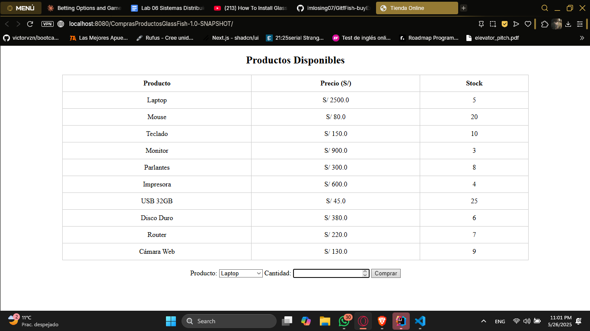
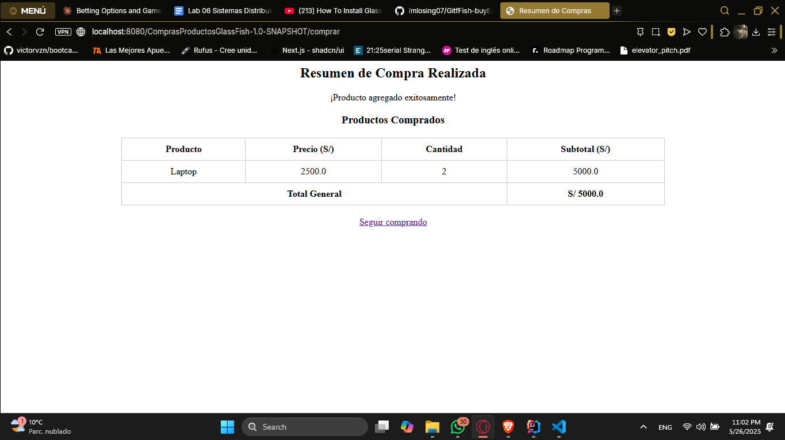
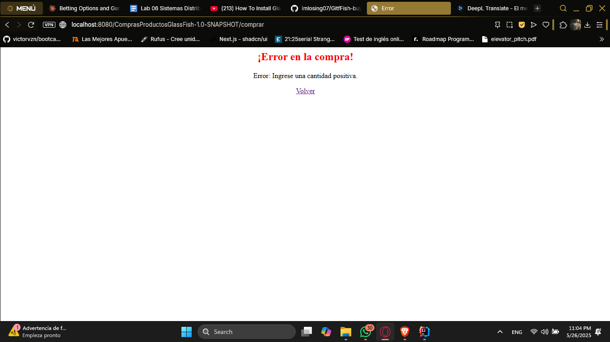

# GlassFish-AppShop

## Overview

**GlassFish-AppShop** is a complete Java web application simulating a secure online product purchase system.  
It features user authentication, session management, comprehensive error handling, and a shopping cart system with persistent purchase history.  
This project demonstrates advanced Java EE (Jakarta EE) concepts including servlets, JSP, session management, and custom error pages.

---

## Features

- 🔐 **User Authentication System** with login/logout functionality
- ✅ **Product Catalog** with dynamic table showing available products and stock quantity  
- 🛒 **Shopping Cart** with quantity validation and session-based persistence
- 📊 **Purchase Summary** with detailed breakdown including subtotals and overall total  
- ⚠️ **Advanced Error Handling** with custom error pages for different scenarios
- 🔒 **Session Security** - protected routes requiring authentication
- 💾 **Persistent Shopping Cart** - maintains cart across user session
- 🎨 **Professional UI** with styled error pages and user-friendly interface

---

## Authentication

- **Username:** `admin`
- **Password:** `1234`

Users must log in to make purchases. Unauthorized access attempts are redirected to custom error pages.

---

## Getting Started

### 1. Clone the repository

```bash
git clone https://github.com/imlosing07/GlassFish-AppShop.git
```

### 2. Requirements

- **Java Development Kit (JDK):** Version 11 or higher
- **IDE:** IntelliJ IDEA (recommended: 2024.1.4)
- **Web Server:** Eclipse GlassFish 6.2.5 (Full Profile)
- **Plugin:** GlassFish Plugin for IntelliJ IDEA

### 3. Deployment

1. Import the project as a Maven project in IntelliJ IDEA.
2. Configure the GlassFish server (point it to the `domain` folder of GlassFish 6.2.5).
3. Deploy the WAR file or run directly from the IDE.
4. Access the application at `http://localhost:8080/ComprasProductosGlassFish-1.0-SNAPSHOT/`

---

## Screenshots

| **Product Table View** | **Purchase Summary** | **Error Handling** |
|------------------------|---------------------|-------------------|
|  |  |  |

---

## Project Structure

```
ComprasProductosGlassFish/
├── src/
│   └── main/
│       ├── java/com/codigo/comprasproductosglassfish/
│       │   ├── BaseDatosSimulada.java      # Mock database with products
│       │   ├── CompraServlet.java          # Purchase processing servlet
│       │   ├── LoginServlet.java           # Authentication handler
│       │   ├── Producto.java               # Product model class
│       │   └── ItemCompra.java             # Shopping cart item model
│       └── webapp/
│           ├── index.jsp                   # Main product catalog page
│           ├── login.jsp                   # User authentication page
│           ├── resultado.jsp               # Purchase summary page
│           ├── error.jsp                   # Custom error handling page
│           └── WEB-INF/
│               └── web.xml                 # Servlet configuration & error mapping
├── screenshots/                            # Application screenshots
├── pom.xml                                 # Maven configuration
└── README.md
```

---

## Key Components

### Authentication System
- **LoginServlet**: Handles user authentication with session management
- **Session Protection**: Validates user sessions before allowing purchases
- **Redirect Logic**: Maintains user's intended destination after login

### Error Handling
- **Custom Error Page**: Professional error display with contextual information
- **Multiple Error Types**: Handles validation errors, server errors, and authentication failures
- **User-Friendly Messages**: Clear guidance for users on next steps

### Shopping System
- **Product Catalog**: Dynamic display of available products with real-time stock
- **Purchase Validation**: Comprehensive checks for stock availability and input validation
- **Cart Management**: Session-based shopping cart with persistent history

---

## Technologies Used

- **Java 11+**
- **Jakarta EE 9+**
- **JSP (JavaServer Pages)**
- **Servlets**
- **Maven**
- **Eclipse GlassFish 6.2.5**
- **HTML5/CSS3**
- **Session Management**

---

## Product Catalog

The application includes a comprehensive mock product database:

| Product Name | Price (S/) | Stock |
|--------------|-------------|-------|
| Laptop       | 2500.00     | 5     |
| Mouse        | 80.00       | 20    |
| Teclado      | 150.00      | 10    |
| Monitor      | 900.00      | 3     |
| Parlantes    | 300.00      | 8     |
| Impresora    | 600.00      | 4     |
| USB 32GB     | 45.00       | 25    |
| Disco Duro   | 380.00      | 6     |
| Router       | 220.00      | 7     |
| Cámara Web   | 130.00      | 9     |

> **Note:** Stock quantities are updated in real-time as purchases are made.

---

## Security Features

- **Session-Based Authentication**: Secure login system with session validation
- **Protected Routes**: Purchase functionality requires authentication
- **Input Validation**: Comprehensive validation for all user inputs
- **Error Containment**: Graceful error handling prevents system crashes

---

## Error Handling

The application includes comprehensive error handling:

- **Validation Errors**: Invalid quantities, out-of-stock items
- **Authentication Errors**: Invalid credentials, session timeouts
- **Server Errors**: 404, 500, and other HTTP error codes
- **Custom Error Pages**: Professional error display with recovery options

---

## Contributing

Pull requests are welcome!  
For major changes, please open an issue first to discuss what you'd like to improve or suggest.

---

## License

This project is licensed under the [MIT License](LICENSE).

---

## Contact

For any questions or suggestions, feel free to [open an issue](https://github.com/imlosing07/GlassFish-AppShop/issues) or contact the maintainer.
